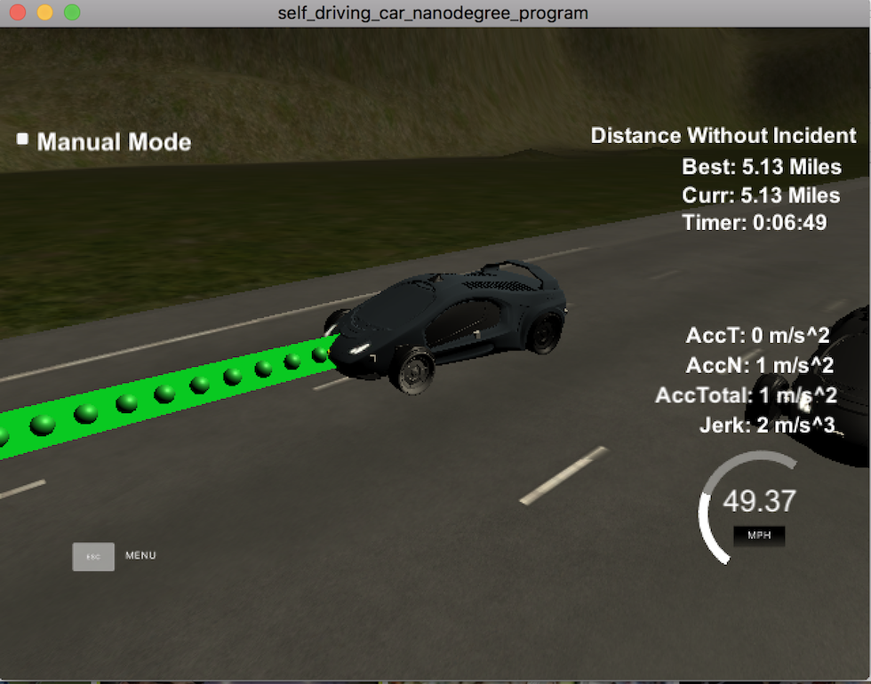

# CarND-Path_Planning-Project-P1

The goal of this project is to build a path planner that creates smooth, safe trajectories for the car to follow. The car transmits its location, along with its sensor fusion data, which estimates the location of all the vehicles on the same side of the road. The car moves to a new waypoint every 20ms. The path planner should output a list of x and y global map coordinates. Each pair of x and y coordinates is a point, and all of the points together form a trajectory.

I have followed the Q and A session and implemented the code step by step. 

Steps : 

1.	Run the simulator as it is.
	- Car remains as it is. NO moving. Because we do not have anything in next_x and next_y.
2.	Run the simulator with straight line code.
	- Car moves straight. Into the tree!
	- First we have to make the car drive in the lane.
3.	Calculation with s and d. Conver them to x and y and supply them to next_x and next_y.
	- Car remains in the center lane.
	- Getting jerk, accel and other errors.
	- Speed is high, Corner points are getting bunched up and because of that we are not getting smooth path.
	- Better polynomial fit is required to make path smoother. Use spline.
	- Now, first focus on accel/jerk reduction.
4.	Accel/Jerk reduction
	- Define lane (1,2,3 ...)
	- Set reference speed as 49.5mph
	- define previous_size (Previous path points size). We have list of previous points which can help us during transition.
	  This is the last path which car was following before it does this particular run through the calculating more points.
	  Simulator informs us about that previous path.
	- Create a widely spaced list of (x,y) waypoints, evenly spaced at 30m. Later,we are going to interpolate these waypoints
	  with a spline and fill it with more points.
	- Keep track of reference state.
	- Create ptsx and ptsy points for path.
	- Use spline to create curve.
	- Use previous path logic to create a continuous path to create a path. Here we keep total 50 points at a time. Remind PACMAN
	  analogy. Create only number of points which are eaten by PACMAN.
	- NOTE : We are dealing with two sets of points. One is sparsed(far) waypoints which are in spline variable s and other is path planning points which are in next_x_vals/y_vals

    - Accel/Jerk done

5.	Still we have Jerk at very beginning and collision problem. We will work on collision now.

	- Now the sensor fusion comes into play. Sensor Fusion data are provided by simulator.
	- It is a vector of vector with some quantities.
	- First, we have to check if the car is in our lane. We can check this with d.
	- We have to find the s value in "future".
	- If we are using previous points, we can project the s value outword in time. If we are using the previous path points, we are
	  not still there. So we are actually want to looking at what the car will look like in future. 
	- If we are looking at previous path points, our path represents a future but we are looking at the current snapshot of where our car sits and
	  all other car sits. So from previous path perspective we want to say where those other cars will look like in future.

	- After getting s in future, we are reducing the speed if the vehicle in same lane and the distance between us and other car is >30m
	- But as soon as it sees other vehicle at 30 m, the car exceeding the accel request of 10 m/s/s

6.	So we have accel/jerk issue at beginning and when it detects other car.
	- We have to ramp in/out the velocity to avoid it. 
	- Simple. Incread ref vel in steps.

7.	Lane Changes
	- If there is car ahead and we don't have any car either in left or right in 30m then change the lane and speed up. 
	- Take care of boundary conditions. Don't take left if we are in lane 0 and don't take right if we are in lane 2. 
	- Do not overspeed or stop.

## RUBRIC POINTS

### The code compiles correctly.
Yes

### The car is able to drive at least 4.32 miles without incident..
I checked it for 5 miles and it is working perfect without any Red errors.

### The car drives according to the speed limit.
The car drives < 49.5mph for complete run.

### Max Acceleration and Jerk are not Exceeded.
Jerk/Accel does not exceed +-10m/s/s limit.

### Car does not have collisions.
No collision warning.

### The car stays in its lane, except for the time between changing lanes.
It stays in lane. No error messages.

### The car is able to change lanes
Car changes lane when there is a slow car ahead of it and no car in environment.

### Reflection

I have explained my complete approach above. The main three parts of the path planner is as below:

1.	Prediction
2.	Behvior
3.	Trajectory

## Prediction

This part senses the environment of ego car. It deals with the sensor fusion data. This module checks if there is a car ahead of us and according to car's speed ego car reduces it's speed and it changes lane if it is safe to. The ego car changes lane only if there in no car +-30 m in the future lane.

## Behavior

This modules takes the decision. According to the results from Prediction module, this module decides if the ego car increase its speed, decrease its speed or is it safe to change the lane and if yes than change the lane.

## Trajectory Generation

With two points from previous path and three sparse points, I have joined the curve using Spline. The points are first transformed to local car coordinates from global coordinates.
After this, using the previous path points I am generating the future path. We have target_x = 30m. we can get y coordinate targey_y by passing target_x to the spline. The pair of points (x,y) are then transformed back to global coordinate system and then pushed into `next_x_vals` and `next_y_vals` list. 

